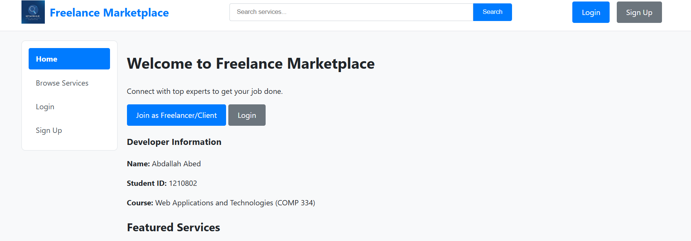
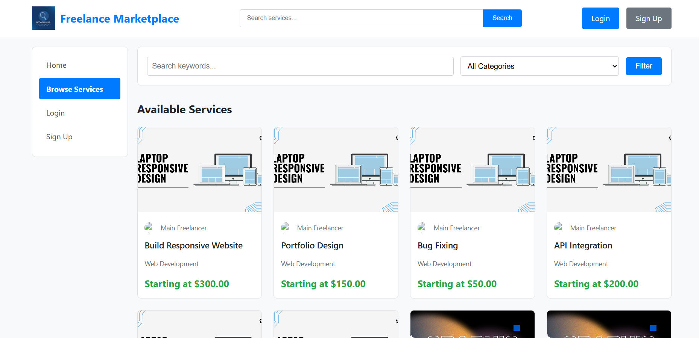
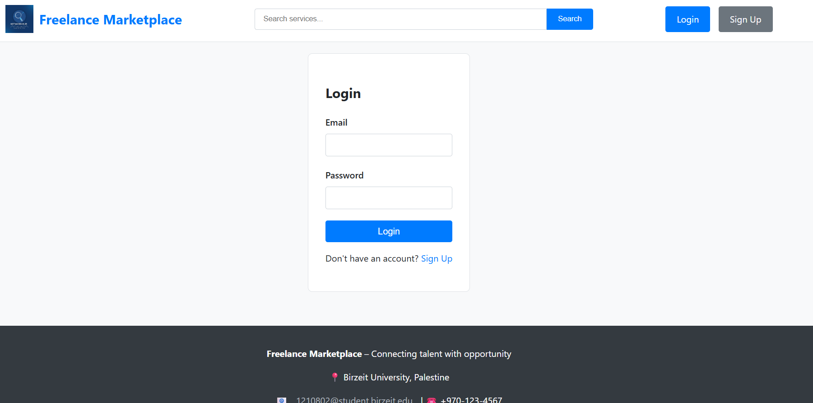

<p align="center">
  
</p>

<h1 align="center">💼 Freelance Marketplace</h1>

<p align="center">
  <b>Full-Stack Freelance Services Platform</b><br/>
  PHP / MySQL Web Application
</p>

<p align="center">
  
  
  
  
</p>

---

## 📌 Overview

**Freelance Marketplace** is a complete web-based platform developed for the **COMP334 Web Application and Technologies course**.

The system connects **clients** with **freelancers** across multiple service categories such as web development, design, writing, and marketing.

It implements a full marketplace workflow including:
- User authentication and role-based access  
- Service creation and management  
- Advanced browsing and search  
- Shopping cart system  
- Multi-step checkout process  
- Complete order lifecycle management  

---

## 🎯 Core Features

### 👤 Authentication & Users
- User registration with validation rules  
- Secure login with session management  
- Role-based access (Client / Freelancer)  
- Profile management with image upload  

---

### 🧑‍💻 Freelancer Features
- Create and manage service listings (multi-step process)  
- Upload and manage service images  
- Set pricing, delivery time, and revisions  
- Activate/deactivate services  
- Feature up to 3 services  
- Track orders and deliver work  

---

### 🛒 Client Features
- Browse and search services with filters  
- View detailed service pages  
- Add services to cart (session-based)  
- Checkout with multi-step process  
- Place orders (one order per service)  
- Track order progress  
- Request revisions and complete orders  

---

### 🔍 Service Marketplace
- Search by keywords (title/description)  
- Filter by category  
- Sort results (price, newest, etc.)  
- Featured services section  
- Responsive service cards layout  

---

### 📦 Shopping Cart & Checkout
- Session-based cart using OOP (Service class)  
- Price locking system  
- Order summary with service fee calculation (5%)  
- 3-step checkout:
  1. Service requirements  
  2. Payment (simulation)  
  3. Review and confirmation  

---

### 📊 Order Management System
- Full order lifecycle:
  - Pending → In Progress → Delivered → Completed  
- Revision system with limits  
- File uploads for requirements and delivery  
- Order cancellation (clients)  
- Delivery uploads (freelancers)  
- Revision requests and responses  

---

## 🏗️ System Architecture

```
Client (Browser)
│
│  HTTP Requests
│
PHP Backend (Server Logic)
│
MySQL Database
```

---

## 🛠️ Technologies Used

### Frontend
- HTML5  
- CSS3 (Flexbox & Grid only)  

### Backend
- PHP (Procedural + OOP)  
- Session Management  
- File Handling (Uploads)  

### Database
- MySQL  
- Relational Design  
- Prepared Statements (PDO)  

---

## 🗄️ Database Design

Main entities include:
- `users`  
- `services`  
- `orders`  
- `cart (session-based)`  
- `files`  
- `reviews`  

> Full schema is included in the project SQL file.

---

## 📸 Screenshots

<p align="center">
  
  
  
</p>

---

## 🚀 How to Run the Project

### 1️⃣ Environment Setup

1. Install **XAMPP / WAMP**
2. Start:
   - Apache  
   - MySQL  

---

### 2️⃣ Database Setup

1. Open **phpMyAdmin**
2. Create database:

```sql
CREATE DATABASE freelance_marketplace;
```
Import the provided SQL file

### 3️⃣ Run the Project
Move project folder to:
htdocs/
Open in browser:
http://localhost/comp334_project

### 🔐 Test Accounts

| Role        | Email                | Password |
|------------|---------------------|----------|
| Client     | client@test.com     | 123456   |
| Freelancer | freelancer@test.com | 123456   |
  
### 📂 Project Structure
```
comp334_project/
│
├── assets/              # Images & UI assets
├── css/                 # Stylesheets
├── includes/            # Database & reusable PHP
├── pages/               # Core pages (services, cart, orders)
├── uploads/             # User & service files
├── database/            # SQL schema
├── index.php
└── README.md
```

### 📌 Key Concepts Implemented

- Session management
- Role-based authorization
- Multi-step forms
- File upload system
- OOP in PHP (Service class)
- Secure database interaction (PDO)
- Complex business logic (orders, revisions, cart)

### 📌 Future Enhancements
- Real payment integration
- Messaging system (client ↔ freelancer)
- Rating & review system UI improvements
- Notifications system
- Mobile responsiveness improvements
### 👨‍💻 Author

Abdallah Aabed
Computer Science Student

GitHub:
https://github.com/abdallahabed

### 📜 License

This project is developed for educational purposes and demonstrates full-stack web development concepts.
